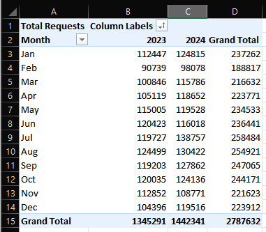
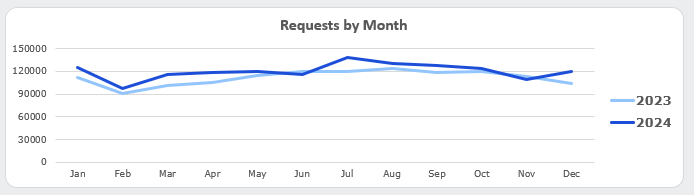
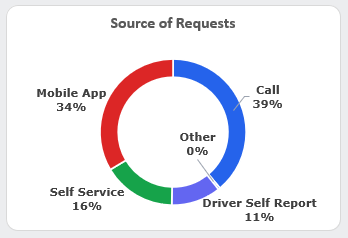
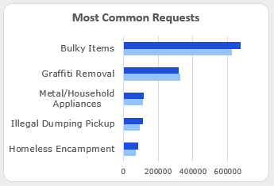
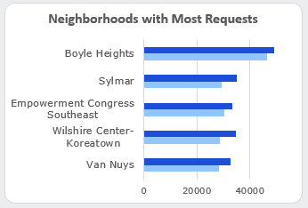
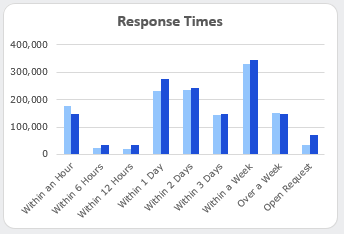
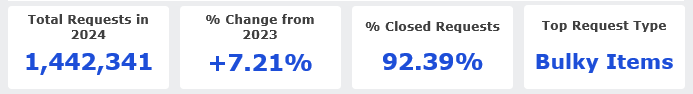
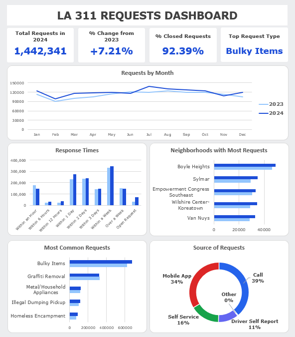

# 📊 LA 311 Requests Dashboard

## About Me  
Hi, I’m Logan Thomas — a data enthusiast and aspiring data analyst.  
This project highlights my end-to-end workflow: starting from raw public data, building a SQL-based ETL pipeline, and finishing with a polished Excel dashboard for insights.  

---

## Project Overview  
This project explores **311 requests in Los Angeles in 2023 and 2024** to uncover trends in service requests.
The workflow followed a **Bronze → Silver → Gold pipeline** approach:  

1. **Data Acquisition**  
   - Downloaded raw 311 service request data from [2024](https://data.lacity.org/City-Infrastructure-Service-Requests/MyLA311-Service-Request-Data-2024/b7dx-7gc3/about_data) and [2023](https://data.lacity.org/City-Infrastructure-Service-Requests/MyLA311-Service-Request-Data-2023/4a4x-mna2/about_data) from Data LA.  
   - Imported into SQL Server for structured processing.  

2. **Data Cleaning (Bronze → Silver)**  
   - Standardized data and fixed data types.  
   - Handled null values and inconsistencies.  

3. **Data Preparation (Silver → Gold)**  
   - Aggregated requests by key metrics.  
   - Exported a clean, analysis-ready CSV.  

4. **Analysis & Visualization in Excel**  
   - Used **Power Pivot** to build a calendar table and relationships.  
   - Created PivotCharts and KPIs for year-over-year comparisons.  
   - Designed a final dashboard.  

---

## Dashboard File  
My final dashboard can be found in [**LA_311_Dashboard.xlsx**](Dashboard/).  

---

## Tools & Skills Used  
The following tools and skills were used across the project:  

- **SQL Server**  
  - ETL pipeline (Bronze, Silver, Gold schemas)  
  - Data cleaning and aggregation queries  

- **Excel**  
  - Power Query  
  - Power Pivot & DAX  
  - PivotTables & PivotCharts
  - Dashboard creation  

---

## Exploring the Data (Visuals) 

Once I had a cleaned CSV, I imported the final product into Excel and started exploring the data, utilizing Pivot Tables to find interesting trends.  

  

Then I began visualizing the data with Pivot Charts.

- **Line Chart** — Monthly 311 request volume (2023 vs 2024)
  
  

- **Donut Chart** — Breakdown of requests by source
  
  

- **Bar Chart** — Top 5 request types
  
  

And neighborhoods with the most 311 calls

 

- **Column Chart** — Analyzing response times
  
  

Next, it was time to create KPI cards that call out key metrics in the data
    
  

Finally, I combined all of the elements into a single dashboard.
    
  

---

## Conclusions  

This project demonstrates how a public dataset can be transformed into an actionable, visual tool.  By leveraging SQL and Excel together, I created a repeatable workflow that ensures data quality and uncovers key insights into 311 requests in the city of Los Angeles.  

---

## Data Source  

This project uses the **311 Service Requests dataset** from [DataLA](https://data.lacity.org).  
The dataset is publicly available for civic and educational purposes.  
